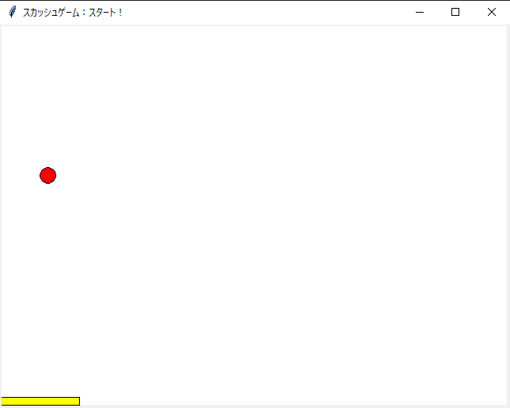

## 説明

このリポジトリは「ゲームセンターあらしと学ぶ プログラミング入門 まんが版こんにちはPython」の公開情報を参考にして作った個人学習リポジトリになります。


## 使い方

source内にあるファイルを直接実行。
```
python **.py
```

1. fizzbuzz

```
python fizzbuzz.py
```

実行結果
```
1
2
フィズ
4
バズ
フィズ
7
8
フィズ
バズ
11
フィズ
13
14
フィズバズ
...
フィズ
97
98
フィズ
バズ
```

---

2. じゃんけん


```
janken.py
```

実行結果
```
1 回目
あなたが出すのは？　（1＝グー、2＝チョキ、3＝パー」の後にEnterを押す）
1
あなたが出したのは…… グー でした
パソコンが出したのは…… グー でした
判定は…… あいこ でした！


2 回目
あなたが出すのは？　（1＝グー、2＝チョキ、3＝パー」の後にEnterを押す）
2
あなたが出したのは…… チョキ でした
パソコンが出したのは…… チョキ でした
判定は…… あいこ でした！


3 回目
あなたが出すのは？　（1＝グー、2＝チョキ、3＝パー」の後にEnterを押す）
3
あなたが出したのは…… パー でした
パソコンが出したのは…… パー でした
判定は…… あいこ でした！

....

10 回目
あなたが出すのは？　（1＝グー、2＝チョキ、3＝パー」の後にEnterを押す）
1
あなたが出したのは…… グー でした
パソコンが出したのは…… グー でした
判定は…… あいこ でした！


10回ジャンケンした結果は、あなたの 2 勝 3 敗 5 引き分けでした。
```

---

3. スカッシュ


```
squash.py
```

実行結果
